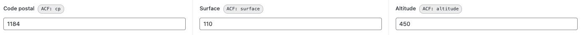

# ACF Field Name Revealer

Extension Google Chrome (Manifest V3) qui affiche le **nom interne** (`data-name`) des
champs [ACF — Advanced Custom Fields](https://www.advancedcustomfields.com/) à côté de
leur label, dans l'administration WordPress.

Pratique pour les développeurs et intégrateurs : plus besoin d'ouvrir l'inspecteur pour
retrouver le nom d'un champ ACF à utiliser dans `get_field()`, un template ou une requête.

---

## Aperçu



Pour le champ ACF suivant :

```html
<div class="acf-field acf-field-text" data-name="municipality_size" data-type="text"
     data-key="field_6a22c6b4e3334">
    <div class="acf-label">
        <label for="acf-field_6a22c6b4e3334">Surface</label>
    </div>
    <div class="acf-input">…</div>
</div>
```

L'extension ajoute un badge à côté du label :

```
Surface  [ ACF: municipality_size ]
```

Un **clic sur le badge copie** le nom du champ dans le presse-papiers.

---

## Fonctionnalités

- Affiche le `data-name` de chaque champ ACF à côté de son label.
- Fonctionne uniquement sur les pages d'administration WordPress (`*/wp-admin/*`).
- Prend en charge les champs chargés dynamiquement : **repeaters**, **flexible content**,
  onglets et groupes (via un `MutationObserver`).
- Ignore les lignes « template » des repeaters (clones) et les `data-name` vides.
- Clic sur un badge → copie de sa valeur dans le presse-papiers.
- Affichage optionnel du `data-key` (ex. `field_6a22c6b4e3334`), utile pour les
  requêtes ACF par clé.
- Deux interrupteurs **on/off** depuis le popup de l'extension (préférences mémorisées).

---

## Installation (mode développeur)

1. Téléchargez ou clonez ce dépôt sur votre machine.
2. Ouvrez Chrome et rendez-vous sur `chrome://extensions`.
3. Activez le **Mode développeur** (en haut à droite).
4. Cliquez sur **« Charger l'extension non empaquetée »**.
5. Sélectionnez le dossier du projet (`chrome-acf`).

L'extension est active : ouvrez n'importe quelle page d'édition WordPress contenant des
champs ACF pour voir les badges apparaître.

---

## Utilisation

- Les badges `ACF: <nom>` apparaissent automatiquement à côté des labels.
- **Clic** sur un badge pour copier sa valeur (nom ou clé).
- Cliquez sur l'icône de l'extension dans la barre d'outils pour ouvrir le popup :
    - **Activer l'affichage** : active / désactive les badges.
    - **Afficher aussi le `data-key`** : ajoute un second badge `key: field_…` à côté du
      nom (désactivé par défaut).

  Les deux préférences sont conservées d'une session à l'autre.

---

## Structure du projet

```
chrome-acf/
├── manifest.json      # Configuration de l'extension (Manifest V3)
├── content.js         # Injecte les badges dans les pages wp-admin
├── content.css        # Style des badges
├── popup.html         # Interface du popup (interrupteur)
├── popup.css          # Style du popup
├── popup.js           # Logique du popup (lecture/écriture de la préférence)
├── make_icons.py      # Génère les icônes PNG (script utilitaire)
├── icons/             # icon16.png, icon48.png, icon128.png
├── docs/              # screenshot.png (capture utilisée dans ce README)
├── CHANGELOG.md       # Historique des versions
└── README.md
```

### Régénérer les icônes

```bash
python3 make_icons.py
```

---

## Personnalisation

- **Format du badge** : modifier `buildBadge()` dans `content.js`
  (texte actuel : `` `ACF: ${name}` ``).
- **Apparence** : ajuster `.acf-name-revealer-badge` dans `content.css`.
- **Portée** : la clé `matches` du `manifest.json` (`*://*/wp-admin/*`) limite
  l'extension à l'administration WordPress.

---

## Compatibilité

- Google Chrome / navigateurs basés sur Chromium (Edge, Brave…) avec Manifest V3.
- WordPress avec le plugin ACF (free ou Pro). Les badges s'appuient sur le markup
  standard `.acf-field[data-name]` généré par ACF.

---

## Changelog

L'historique des versions est disponible dans [CHANGELOG.md](CHANGELOG.md).

## Auteur

**Michaël Ambass** — <michael.ambass@troisdeuxun.ch>
[troisdeuxun sàrl](https://troisdeuxun.ch)

## Licence

© troisdeuxun sàrl. Tous droits réservés.
